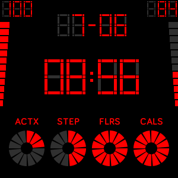
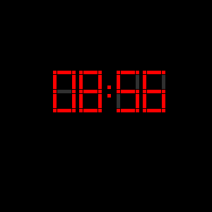

# Arkana Clock

Product is available on: [Fitbit App Gallery](https://gallery.fitbit.com/details/999704aa-d10a-4a4d-b8c0-1fc116f87c78).

### Screen shots

Active mode | Always-on mode
----------- | -------------
 | 

### Descriptions
```
Digital clock with activities and sensors.

----
Components:
- battery rate and level indicator (top left)
- heart rate and level indicator (top right)
- day, month and time (center)
- personal goals progress: active minutes, steps, floors and calories (bottom)

----
Key features:
- battery friendly clock face, series of optimisations are increasing your battery life,
- colours configuration, use clock settings to build your own display colour combination,
- change between 12/24 hour display in your personal settings on the Fitbit website or mobile application.

----
Arkana Clock - builded with passions :)
```

### Tech summary
```
No third-party libraries and dependencies.
Built based on Fitbit guidelines and best practices.
Small size and UI refreshing optimisation.
```
