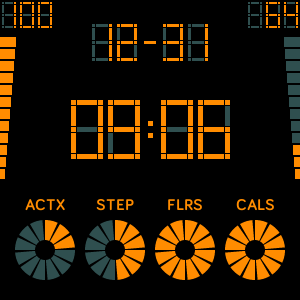

# Arkana Clock

Product is available on: [Fitbit App Gallery](https://gallery.fitbit.com/details/999704aa-d10a-4a4d-b8c0-1fc116f87c78).

### Screen shots

|    Screen    |    Screen    |    Screen    |
| :----------: | :----------: | :----------: |
 |  | 
 |  | 

### Store summary
```
Simple and elegant watch face. Retro design, reach of content:
- battery rate and level indicator (top left)
- heart rate and level indicator (top right)
- month, day and time (center)
- personal goals progress: active minutes, steps, floors and calories (bottom)

----
Key features:
- always up to date heart rate value,
- calculate daily activity progress based on personal goals,
- colours configuration, use clock settings to build your own display colour combination,
- date format configuration, select between day-month and month-day date format in clock settings,
- battery friendly clock face, series of optimisations are increasing your battery life.

----
Arkana Clock - builded with passion :)
```

### Tech summary
```
No third-party libraries and dependencies.
Built based on Fitbit guidelines and best practices.
```

### TODO

- extract settings keys to `common` shared properties
- change battery indicator to configurable component, options: `battery`, `steps per hour`
- enable AOD mode in `index` and `package.json`
